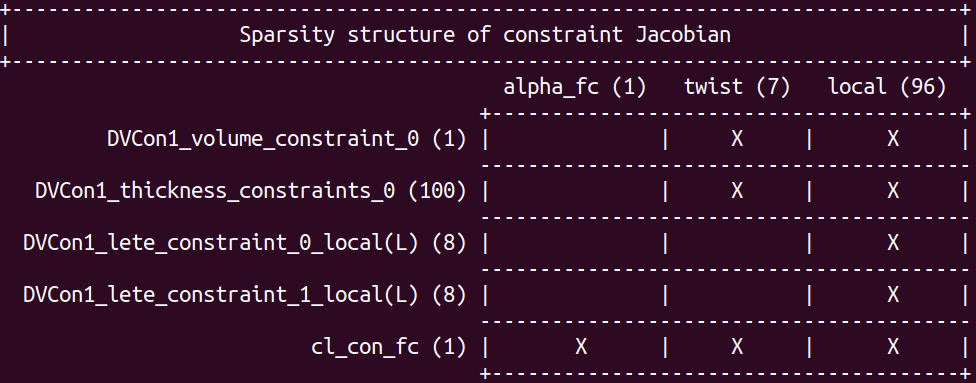

**************************************
Pre-run checklists and troubleshooting
**************************************

Here we list several things to check before running optimizations with MACH and some tips on how to troubleshoot.
These are meant to be used along with the :ref:`General Checklists <private-docs:optimization_checklist>` in the MDO Lab Guide.

Before you run (checklists)
===========================

You should always call the :meth:`printSparsity() <pyoptsparse:pyoptsparse.pyOpt_optimization.Optimization.printSparsity>` method of your pyOptSparse "optimization problem" object (i.e., your instance of the :class:`Optimization <pyoptsparse:pyoptsparse.pyOpt_optimization.Optimization>` class).
In our example scripts this can be done by adding the line ``optProb.printSparsity()`` before the command that runs the optimization.
This will print some output that should be checked to make sure that the necessary variables and constraints have been added before you leave the case there to run.
The following is an example.

This allows us to check which constraints and design variables have been added, how many of each, and which design variables each function depends on.

Aerodynamic optimization
------------------------

#. Check the relative density between your FFD control points and surface mesh nodes. The general rule of thumb is that there should be at least 4 mesh nodes between two FFD control points.

#. Test your geometric design variables to make sure they behave as expected and that the ranges are reasonable (e.g., they don't cause negative cell volumes). You can use ``demoDesignVars`` in ``pygeo`` to perform the perturbation demo. See :ref:`negative cell volumes check <negative_volumes>` for how to identify negative cell volumes. Pay extra attention to this when you use multi-level FFDs.

#. If you want to rotate the FFD in different directions, check more details about how the reference axis is defined in the code's docstrings. There are different rotation types that can be defined using ``rotType``. This option basically determines the ordering of performing the rotation. 

#. Check if the ``raySize`` (used in ``addRefAxis``) is sufficient for your case. You might need to increase it if you have a highly swept design.

#. If you have multi-level FFDs, check that all the necessary options are specified and that the constraints are properly added. For example, if you have child FFDs, when you specify the LETE constraints, make sure that the ``childIdx`` is given. Otherwise it will be added to the parent FFD.

#. Check if the geometric constraints have been properly added. Use DVConstraints' ``writeTecplot`` method for this (e.g., ``DVCon.writeTecplot(os.path.join(outputDirectory, "constraints.dat"))``). This will output a file that allows visualizing the constraints with Tecplot. Open this file in tecplot, select ``3D cartesian``, and turn on the ``Mesh`` option. Different constraints are shown in different zones. The following is an example with the wing surface superimposed to show what this should look like (thickness and LETE constraints).

    .. image :: images/opt_constraints_dat.png
        :scale: 30

#. Using ``checkSolutionFailure`` and ``checkAdjointFailure`` in ADflow will set the value for ``funcs['fail']`` and ``funcsSens['fail']`` respectively, based on the analysis and adjoint solutions. However, they are not passed into ``pyOptsparse`` if you are not using ``multipointSparse``. If you want to use them without ``multipointSparse``, you need to manually return them,  i.e. ``return funcs, funcs['fail']`` and similarly for ``funcsSens``.

#. Check if you have specified all the necessary variables of interest in ``volumevariables`` and ``surfacevariables``. Keep in mind that increasing the number of variables being stored will increase the file sizes (especially for volume files), which may be problematic if you have storage or file-transfer limitations.

#. Check if the ``LdefFact`` is sufficient. You might need to increase it if you have a large deformation. Check more details in :ref:`IDWarp options <idwarp:idwarp_options>` (also see other options). 

#. One general rule of thumb is to set the adjoint tolerance two orders of magnitude lower than the target optimality. Based on past experience, the adjoint solution tends to be an order or two less accurate than the required optimality for numerical reasons.

#. Check your load balancing, including the ADflow load balancing across procs and the multipoint balancing. For multipoint cases, you want the evaluation for each condition to take approximately the same time. Check not only the analysis, but also the adjoints (they can be more costly).

#. Check the geometry changes during the early stage of your optimization, and make sure the changes are as expected.

Optimization with overset meshes 
--------------------------------

#. Check that you have ``blank`` in ``volumevariables``.

#. Even if the implicit hole cutting does not output any errors, double check that your volume cells have iblank values that make sense (see :ref:`overset_ihcc` for how to visualize the iblank values). For example, cells inside a wing or strut should be flooded or blanked.

Structural optimization
-----------------------

#. Check that the boundary conditions and loads have been applied correctly. 

#. Check that the design variables and properties have been added to the correct components.

#. Check that the ``Loadfactor`` and ``SafetyFactor`` have beed defined correctly. 
 

Aerostructural optimization
---------------------------

#. Check your rigid links as mentioned in :ref:`aerostruct_overview`.

#. Check derivatives with single disciplines first (i.e., aero and structural respectively), and then check derivatives with coupled aerostructural solutions. Finite differencing might suffice, but it's always better to confirm with the complex-step method.

#. Check derivatives with as many design variables as you can.

#. When debugging, it might be helpful to turn on the ``coldstartMDA`` option.

#. Check that the MDA converges tightly enough.

#. Check that the coupled adjoints converge tightly enough.

If things failed (troubleshooting)
==================================

- **If you have a jagged, wavy pressure distribution:** low-speed cases generally require smoother meshes compared to typical high-speed cases (> M 0.3), as they are sensitive to perturbations. A mesh that gives a smooth pressure distribution at typical flight Mach numbers might not be acceptable for low-speed conditions. Here are some tips on how to improve these kinds of issues:

    #. Check if you have a fine enough spacing for the airfoil coordinates used to generate the wing surface (assuming you generated the surface with airfoil coordinates).
        
        To refine the point distribution of your airfoil coordinates, you can use ``pySpline``.
        An example script is shown below.
        The arguments of :class:`pySpline.Curve() <pyspline.pySpline.Curve>` can be used to change the order and number of control points of the spline-fit for the original coordinates, and the :meth:`getValue <pyspline.pySpline.Curve.getValue>` method used to output more coordinates.

        .. code-block:: python

            from pyspline import pySpline

            x,y = numpy.loadtxt('NACA642A015.dat',unpack=True)
            
            curve = pySpline.Curve(x=x,y=y,k=4,Nctl=11,niter=500)

            data = curve.getValue(numpy.linspace(0,1,1000))
            
            f = pySpline.openTecplot('naca_data_more.dat', 2)
            
            pySpline.writeTecplot1D(f, 'interpolated', data)

    #. Check if you have a small enough ``Triangulation Tolerance`` in ICEM (``Settings -> Model/Units``) when you generate a surface mesh (recommended value: 1e-8). ICEM triangulates B-spline surfaces and curves when it reads Tetin files. ``Triangulation Tolerance`` is the distance allowed between the triangle edge and the actual surface edges. A smaller tolerance gives a better representation of the surface. For more details please see the ICEM manual.

    #. Check if you have a smooth spacing transition between adjacent blocks when generating the surface mesh in ICEM.

    #. Below are some pictures demonstrating this issue (the wing shown in the overset tutorial):
        
        - The initial mesh at Mach 0.15:

            .. image:: images/checklist_badinitial.png
              :scale: 20

        - The initial mesh at Mach 0.3:

            .. image:: images/checklist_higherMACH.png
              :scale: 20

        - After improving the ``Triangulation Tolerance`` (Mach 0.15):

            .. image:: images/checklist_triangulation.png
              :scale: 20

        - After using pySpline to refine the section geometry (Mach 0.15):

            .. image:: images/checklist_pyspline.png
              :scale: 20

- **If the feasibility does not seem to decrease:**

    #. Check if your adjoint solution converges fine.

    #. If you use KS constraints or heaviside functions in any of your constraints, try to decrease the KS weight or the sharpness parameter.

    #. Your gradients could be wrong if you haven't checked them thoroughly.

- **Symptoms of negative volumes during optimization:**

    #. The ADflow output will indicate that there was a failure.

    #. ADflow saved a ``failed_mesh.cgns`` file.

- **If you have negative volumes and want to identify where the negative cell volumes are**
    .. _negative_volumes:

    #. Load the ``failed_mesh.cgns`` in Tecplot; 
    
    #. Turn on ``Mesh`` in ``show zone layers``, and switch on all zones that you want to show in ``Mesh -> Show Zone`` and ``Mesh -> Show Mesh``;

    #. In ``Zone Style -> Surfaces -> Surfaces to Plot``, choose ``All surfaces``;

    #. From ``Analyze -> Calculate Variables``, choose ``Cell Volume``; 
    
    #. From ``Plot -> Blanking``, choose ``Value Blanking``, switch on ``include value blanking`` and ``active``, choose blank entire cells when ``primary value is blank``, and choose blank cells when ``Cell Volume is greater than 0``;

    #. ``Ctrl+E`` or ``View -> Fit Everything`` to zoom in to the region where you have the negative cell volumes.

- **If your CFD does not converge well:**

    - Check the :ref:`ADflow options <adflow:adflow_options>` and :ref:`ANK options <adflow:adflow_solvers>` to see how you can change parameters to make the convergence better. 
 

- **If the MDA does not converge well:**

    #. Try different values for ``damp0`` that is used in ``aitkenAccelaration``.

    #. Try different values for ``dampUB`` and ``dampLB`` (``dampUB`` is currently not an option. You might need to manually specify it in pyTACS. This will be updated to be an option soon.) In particular, try increasing ``dampUB`` if your MDA updates extremely slowly at later stages.

    #. Try with ``MDSolver: 'NK'``. There are different options for ``NK``, for example, ``newtonls`` and ``newtontr``. More options can be found in the PETSc manual. You can change it by setting ``nktype':'newtonls``. (TODO: CNK solver currently does not work properly. Will update once it's done.)

- **If your coupled adjoints do not converge well:**

    #. If you are using ``KSP`` as the adjoint solver and it stalls:
        
        - Try increasing ``MDSubSpaceSize``;
        - Try using ``adjointSolver: GS`` (this is robust but EXTREMELY slow).

    #. Try using a tighter tolerance for the MDA to see if that helps.

- **If your adjoint solutions stall when using an overset mesh:** 

    - Some adjoint stalls might be inevitable for now. It's known that with some recent fixes to the zipper mesh code, some adjoint solutions may stall. There's no solid solution at the moment. You can play with the adjoint parameters. However, it's very likely that the adjoints can still converge to an acceptable level. Set ``skipafterfailedadjoints`` to ``False``, so that you can still compute sensitivities even thought the adjoints do not converge to the desired tolerance.
 