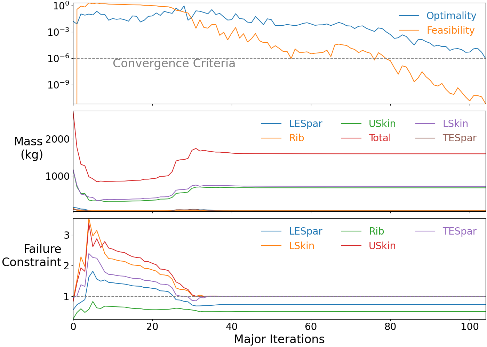
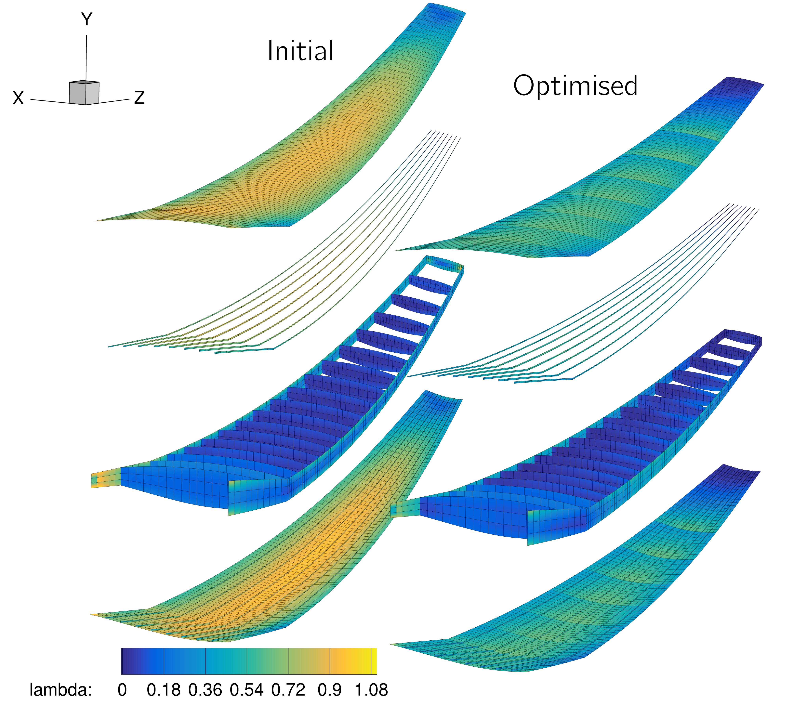

.. _opt_struct:

***********************
Structural Optimization
***********************

Introduction
============

In this section we will walk through the structural optimization runscript.
Most of the code is shared with the structural analysis file discussed in :ref:`struct_analysis`, so be sure to have understood and tried it before moving on to optimization.

Here, we perform a single-point mass minimization problem subject to stress constraints.
The exact problem formulation is

| *minimize*
|    structural mass :math:`m`
| *with respect to*
|    108 panel thicknesses
| *subject to*
|    stress constraints :math:`\mathrm{KS} \le 1.0`

The sparsity structure of the constraint Jacobian for this problem is very simple and dense since all the structural design variables are in one group, on which all our constraints depend::

    +-------------------------------------------------------------------------------+
    |                   Sparsity structure of constraint Jacobian                   |
    +-------------------------------------------------------------------------------+
                                  struct (108)
                                +--------------+
        2.5g_USkinKSFailure (1) |       X      |
                                ----------------
        2.5g_LSkinKSFailure (1) |       X      |
                                ----------------
       2.5g_LESparKSFailure (1) |       X      |
                                ----------------
       2.5g_TESparKSFailure (1) |       X      |
                                ----------------
          2.5g_RibKSFailure (1) |       X      |
                                +--------------+

Files
=====
The run file we use in this section is ``struct_opt.py``, with the same input and setup files used in the :ref:`structural analysis <struct_analysis>` section.

Dissecting the structural optimization script
=============================================

Setting up TACS
---------------

This part of the code is almost identical to the analysis code, we are setting the aero and gravity loads, without the additional tip and distributed loads.
Additionally, we are adding a set of adjacency constraints, in this case we are constraining all adjacency panels in the skins, spars and stringers to be within 5mm of any adjacent panels.
Note that we are applying these constraints **across** all three component groups, meaning that adjacent panels from different groups must still satisfy the adjacency constraints.
If we called `addAdjacencyConstraints` 3 separate times (once each for skins, spars and stringers) then the constraints would only apply **within** each group, i.e a stringer could differ in thickness from the adjacent skin panel by more than 5mm.
Adjacency constraints can be very effective in making the optimisation problem easier for SNOPT to solve as they significantly reduce the design space (even when they do not actually constrain your optimised design much), they are also passed to pyOptSparse as linear constraints which can be handled very efficiently, they require no additional gradient evaluations and many optimisers can guarantee they will be satisfied at every iteration.

.. literalinclude:: ../tutorial/wing/struct_opt.py
    :start-after: # rst Init (begin)
    :end-before: # rst Init (end)

Defining the functions and the sensitivities
--------------------------------------------
Here we take a slightly different approach from what is done in the aerodynamic and aerostructural optimization scripts.
Since this is a single-point optimization problem, we don't need to use the ``multipoint`` package.
Recall that with ``multipoint``, you would define ``cruiseFuncs`` and ``cruiseSens``, and similar for the maneuver point.
These functions are associated with each processor set and are called only on those processors to evaluate the functions and sensitivities.
Then, at the end, there is another function called ``objCon`` which is used to combine those values from different points to obtain the objective and constraints, together with their sensitivities and pass those to the optimizer.

Here, because we only have one point, we don't have to rely on ``multipoint`` and instead can directly use the native pyOptSparse format for passing values.
We define the function ``obj`` which computes all objectives and constraints, and the function ``sens`` for computing their sensitivities.
Note that these are analogous to the internal function ``MP.obj`` and ``MP.sens`` passed to ``pyOptSparse`` when using ``multipoint``.

Something of importance here is that we define two different lists of functions to be evaluated, ``dispFuncs`` and ``objConFuncs``.
``dispFuncs`` are all the functions we want to keep track of during the optimization, here we include all the functions defined in the structural setup script and then pass this list to the structural problem through the ``evalFuncs`` argument.
This means that TACS will compute and return all these functions by default when ``FEASolver.evalFunctions`` is called in the ``obj`` function at each function evaluation during the optimization and they will all be stored in the optimization history file.

On the other hand, ``objConFuncs`` only contains the functions that are used in the optimization objective and constraint functions, and that we therefore need to compute derivatives of.
We therefore only include the total wingbox mass function, and the KS Failure functions.
When we call ``FEASolver.evalFunctionsSens`` inside the ``sens`` function, we then pass in ``objConFuncs`` as the ``evalFuncs`` argument to avoid wasting time computing the derivatives of the ``dispFuncs`` that are not involved in the optimization.

Finally, notice that we include a bit of code to print out all the various mass and failure function values ina nice format at each function evaluation.
This is very useful for getting an idea of how the optimization is progressing without having to open up optView.

.. literalinclude:: ../tutorial/wing/struct_opt.py
    :start-after: # rst Init (end)
    :end-before: # rst Funcs (end)

Setting up and running the optimization problem
-----------------------------------------------
Finally, we create the optimization problem, setting the objective and constraints.
As before, we use the function :meth:`FEASolver.addVariablesPyOpt <pytacs:pytacs.pytacs.pyTACS.addVariablesPyOpt>` to add the variables associated with this structural solver to the optimization problem.
As we will see later, if we included adjacency constraints, then similarly we must call ``FEASolver.addConstraintsPyOpt`` to add those as well.

.. literalinclude:: ../tutorial/wing/struct_opt.py
    :start-after: # rst Funcs (end)
    :end-before: # rst Post (start)

Postprocessing
---------------
Once the optimization is complete, we can write out the results of the last run TACS analysis, which should be the optimum design.
To view the history of the functions we saved during the optimization, we could use optView or, as we do here, you can directly read the history file back into python using pyOptSparse's ``History`` class.
The ``getValues`` method of the class will, by default, return a dictionary of arrays which contain the values of all our saved functions from each major optimiser iteration, along with other useful values such as optimality and feasibility.
Using this method rather than optView allows you more control over what you plot and is also recommended if you want to make nice looking history plots for any kind of publication.

.. literalinclude:: ../tutorial/wing/struct_opt.py
    :start-after: # rst Post (start)

