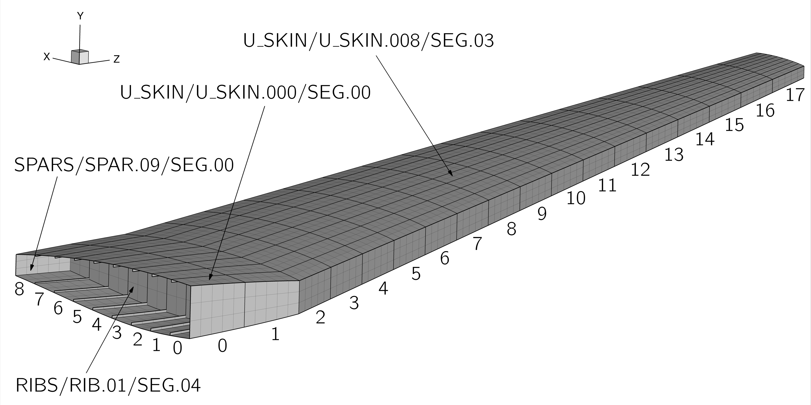
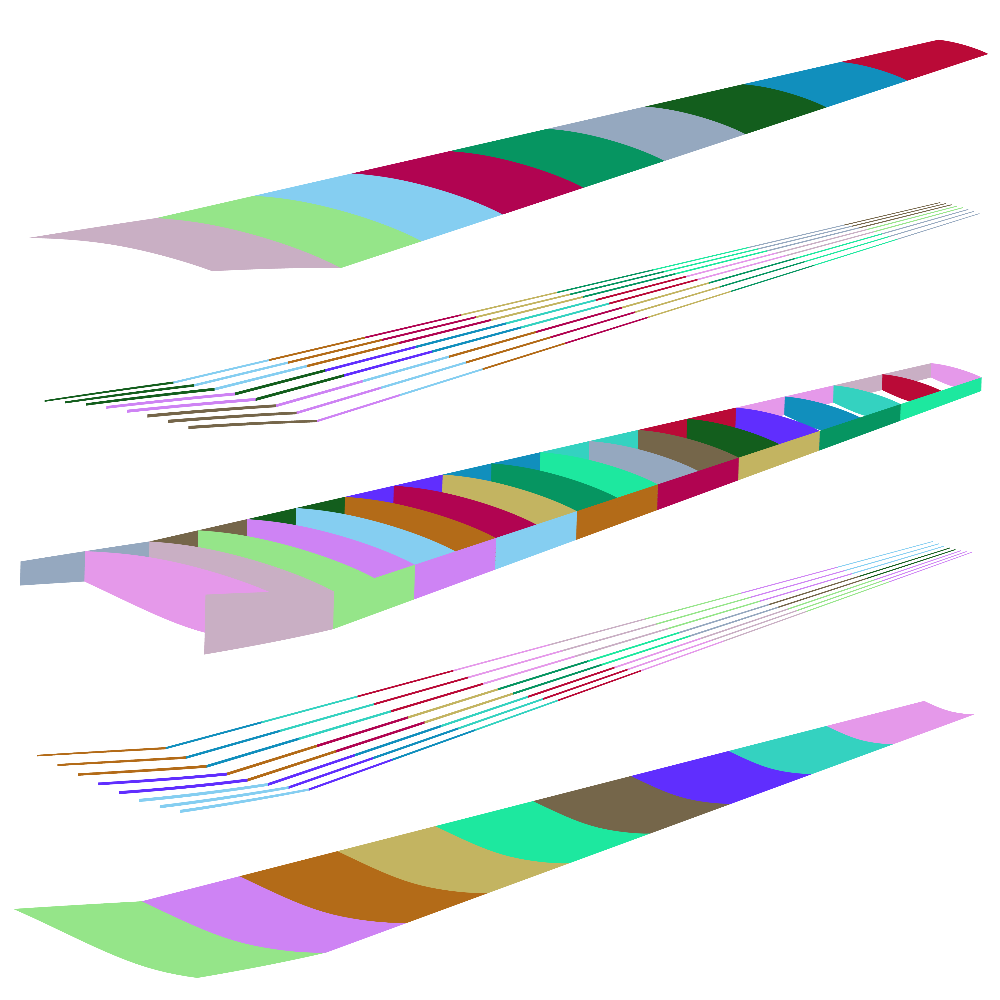
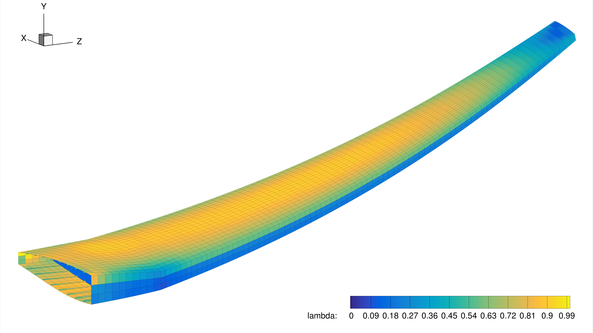

.. _struct_analysis:

*****************************
Structural analysis with TACS
*****************************

Introduction
============
We now have a structural mesh and a set of loads that we want to apply to the structure.
In this tutorial we will use these to setup and run a simple structural analysis of the wingbox in TACS.

Files
=====
In this section we refer to the ``struct_run.py`` run files, which uses the ``.bdf`` structural mesh and the ``forces.txt`` aerodynamic loads from ``INPUT``.
The setup file is ``setup_tacs.py``.

Dissecting the TACS runscript
=============================

Set up TACS
-----------
Typically, the structural setup is done in a separate script, so that the main runscript is more organized.

.. literalinclude:: ../tutorial/wing/struct_run.py
    :start-after: # rst start initialize-TACS
    :end-before: # rst end initialize-TACS

Go ahead and create a directory called ``SETUP``::

    $ mkdir SETUP

Create an empty file here called ``setup_tacs.py`` and open it in your editor, this is going to be the file we work on for the remainder of this section.
All that is necessary to initialize TACS is our BDF mesh file.
BDF files are used as input files in NASTRAN, where they can be used to fully define an analysis, including material properties, loading and boundary conditions etc as well as just the mesh itself.
In TACS we only use BDF files to store the mesh and its boundary conditions.
Use the following code to import the relevant TACS and pyTACS modules, and begin the ``setup`` function by creating an ``FEASolver`` instance from our wingbox mesh file:

.. literalinclude:: ../tutorial/wing/SETUP/setup_tacs.py
    :end-before: # rst end setup_tacs-init

Set up design variables
~~~~~~~~~~~~~~~~~~~~~~~
Even though we are not optimizing the structure here, we need to set up design variable groups so that we can specify the distribution of material properties/thicknesses over the wingbox.
In :ref:`wingbox geometry creation tutorial<struct_geo>`, we defined 19 rib stations and 10 spar stations, that means the wingbox surfaces are currently split into 18 spanwise zones and 9 chordwise zones, in TACS we usually refer to each zone as a **component**.

The figure below shows these zones along with some examples of the naming scheme used for the components by pyLayout.
You can recreate this in Tecplot by opening up the ``wingbox.dat`` file and enabling `Edge` display, and you can find all the component names by opening up ``wingbox.bdf`` in a text editor.
For the ribs and skins, the first number in the name denotes the spanwise position of the component and the `SEG` number denotes the chordwise location.
For the stringers and spars this is reversed, `SPAR.09/SEG.00` is the segment of the trailing edge spar closest to the wing root and `SPAR.00/SEG.02` is the third segment of the leadingedge spar, moving from root to tip.

We could keep all these components separate and thus be able to assign a different shell thickness to each one.
However this is a bit overkill and so in the following code we will create of design variable groups by combining these components to achieve a more realistic parameterisation of the wingbox sizing.

Ribs
++++

Start by making a DV group for each rib.
To do this we simply loop through the numbers 1 to 18 and then call pyTACS' ``addDVGroup`` function to assign every component in the n\ :superscript:`th` rib to a new DV Group.
The first argument to the ``addDVGroup`` function simply categorizes this DV Group which will be useful later.
The remaining input arguments are used to tell pyTACS which components to add to this group.
We can use any argument accepted by the powerful pyTACS function :meth:`selectCompIDs <pytacs:pytacs.pytacs.pyTACS.selectCompIDs>`.
In this case we use the ``include`` argument in order to find all components whose names contain `RIB.01` etc, and add them to the new DV Group.

.. literalinclude:: ../tutorial/wing/SETUP/setup_tacs.py
    :start-after: end setup_tacs-init
    :end-before: end setup_tacs-ribDVs

Spars
+++++

We will now create a DVGroup for every 2 panels on each of the leading and trailing edge spars, this time we use ``include`` to find all the components in each spar, and then the ``ngroup`` argument to split these components into 9 groups [#]_.

.. literalinclude:: ../tutorial/wing/SETUP/setup_tacs.py
    :start-after: end setup_tacs-ribDVs
    :end-before: end setup_tacs-sparDVs

.. [#] When you specifiy ``ngroup`` > 1, pyTACS will list all the selected components in alphabetical order and then split them into groups so make sure this results in the grouping you expect when using in your own code.

Skins
+++++

We will split both the upper and lower skins into 9 spanwise groups, combining all the chordwise components.
To show off the capabilities of pyTACS we will do this differently than we did for the spars and stringers, using the ``includeBounds`` argument.
In this case, we use the ``include`` argument to narrow our selection down to the upper or lower skin, we then pass a list of components (in this case the leading and trailing edge spars and two ribs) as the `includeBounds` argument, which tells pyTACS to narrow down the selection to only include components inside the boundary created by these components.

.. literalinclude:: ../tutorial/wing/SETUP/setup_tacs.py
    :start-after: end setup_tacs-sparDVs
    :end-before: end setup_tacs-skinDVs

Stringers
+++++++++
Finally the stringers, we will again split the stringer components into 9 spanwise groups, but we will also split them into 3 groups in the chordwise directions:

.. literalinclude:: ../tutorial/wing/SETUP/setup_tacs.py
    :start-after: end setup_tacs-skinDVs
    :end-before: end setup DV

The conCallBack function
~~~~~~~~~~~~~~~~~~~~~~~~

The process of creating the TACS model revolves around a special function referred to as the **constitutive callback** or ``conCallBack`` function.
This is a function that we write and then give to pyTACS [#]_, while setting up the model, pyTACS will then call this function for each of the DVGroups we just created and expects to recieve a constitutive object back.
A constitutive object dictates the constitutive relations of the elements in the group, that relate displacements to stresses and strains, and also any design variables related to the group.

The ``conCallBack`` function has a specific signature that you can see in the code below and must be followed in order for TACS to call it correctly.
In this ``conCallBack`` example, we use the ``compDescripts`` and ``userDescript`` inputs to set different thicknesses for each component type, a relatively simple example of what you can do with a ``conCallBack``.
Each time ``conCallBack`` is called, ``compDescripts`` is a list of the components in the DV Group and ``userDescript`` is name we used to categorize the group when we created it (`RIBS`, `SPARS` etc).

The material properties, thickness value and thickness limits are then used to create an ``isoFSDTStiffness`` constitutive object, which models and isotropic shell using First-order Shear Deformation Theory (FSDT), see the :ref:`explanation of TACS' output variables<struct_overview>` for more details on what this means.

.. [#] A callback function is a function that is used as an input to another function.

.. literalinclude:: ../tutorial/wing/SETUP/setup_tacs.py
    :start-after: end setup DV
    :end-before: end conCallBack

Once ``conCallBack`` is defined, we can create the TACS model by calling ``createTACSAssembler``, at this point we can also output a special version of a TACS output file which can be used for visualising the DV Groups, as is done in the image below.

.. literalinclude:: ../tutorial/wing/SETUP/setup_tacs.py
    :start-after: end conCallBack
    :end-before: end createAssembler

Add functions
~~~~~~~~~~~~~
Now we define a few functions that we're interested in from this analysis.
In this case we want to know the mass of, and the maximum von Mises stress within, the wingbox, all of which are added using the ``addFunction`` method.
Like we did when creating DV Groups, we use the ``include`` argument to control which components each function is computed on.
Descriptions of all the functions you can use can be found in the pyTACS :meth:`addFunction <pytacs:pytacs.pytacs.pyTACS.addFunction>` documentation.

In the code below we first define a series of component groups that we will apply functions to.
We then add a function to compute the mass of the entire wingbox and then, for each component group we add a mass function, a maximum failure function and a KS aggregated failure function.
Finally, we return the ``FEASolver`` instance.

.. literalinclude:: ../tutorial/wing/SETUP/setup_tacs.py
    :start-after: end createAssembler

Advice on failure functions
+++++++++++++++++++++++++++
Usually in an optimization, we want to constrain the maximum value of some failure criteria in the wingbox to be less than 1, the obvious way to do this is to place a constraint on the value of the ``MaxFailure`` constraint.
However, this is a bad idea for a gradient based optimizer because the gradient of the maximum of a set of values is discontinuous.
A more intuitive explanation is that, when using a maximum value, the optimizer will only be motivated to reinforce the component which contains the point of maximum stress, even if many other panels have very high stresses, leading it to make very inefficient progress.
The other possibility would be to use separate constraints for the failure criterion at every point in the structure, but this would result in thousands of constraints which would be too expensive to compute the gradients of.

To solve this problem, we use an aggregation function, which provides a smooth estimate of the maximum of a set of values.
In our work, we most commonly use the KS (Kreisselmeier-Steinhauser) function:

.. math::
    KS\left(f_i\left(x\right)\right) = \frac{1}{\rho}\ln\left(\sum_{i}^{N_f} e^{\rho f_i\left(x\right)}\right)

The constant :math:`\rho` is the ``KSWeight``, a low :math:`\rho` will make the KS function smoother but will also lead to overprediction of the maximum value when there are many large values, using a high value has the opposite effect.
We usually find a value of 100 to be a good compromise between the two but it's always a good idea to compare to the true maximum by adding ``MaxFailure`` functions as we have done above.

Finally, notice that we used the averaged failure functions, ``AverageKSFailure`` and ``AverageMaxFailure``.
These functions work with element-averaged stresses rather than the stresses computed at the integration points within the elements.
This tends to alleviate the negative effects of any unrealistic stress spikes that sometimes occur in some mesh elements.

Set up load case
----------------
Now we return to the main ``struct_run.py`` script.
Just like the aerodynamic flow conditions are set in the AeroProblem, the load case for the structure is set in the StructProblem.
For this case, we have a ``loadFile`` exported from ADflow for a 2.5g maneuver.
We specify a ``loadFactor`` of 2.5, this amplifies the inertial (gravitational) loads applied to the wingbox to represent the upward acceleration the aircraft would experience when producing 2.5g of lift.
We can also specify which functions to evaluate by default with each call to ``FEASolver.evalFunctions``, in this case we evaluate all the functions we created earlier but in other cases you may want to only evaluate a subset of these.

.. literalinclude:: ../tutorial/wing/struct_run.py
    :start-after: # rst end initialize-TACS
    :end-before: # rst end structProblem

Now we demonstrate a few methods for adding loads to the wingbox.
On top of the aero loads we just added when creating the StructProblem, we add a vertical force distributed over the tip rib and a pressure load on the lower skin.
Somewhat confusingly, a positive pressure load is applied in the outward surface normal direction, so to apply a pressure load acting in the way we would intuitively imagine, we need to use a negative value for the pressure.
Finally we add the inertial loads, the loads resulting from the mass of the wingbox itself.

.. literalinclude:: ../tutorial/wing/struct_run.py
    :start-after: # rst end structProblem
    :end-before: # rst end loads

Solving and computing functions
-------------------------------
The system of governing equations is solved for a given structural problem by calling ``FEASolver(sp)``.
Then we compute the desired functions by calling ``FEASolver.evalFunctions`` before printing them out.

.. literalinclude:: ../tutorial/wing/struct_run.py
    :start-after: # rst end loads
    :end-before: # rst end evalFuncs

Run it yourself!
================

Take note of any discrepancy between the ``KSFailure`` and ``MaxFailure`` values, if they are too large you might want to increase the ``KSWeight``, if not, you may want to see how much you can decrease the weight to make the aggregated function smoother before the discrepancy becomes too large. ::

    $ mpirun -np 4 python struct_run.py

The f5 files output by TACS are not viewable in Tecplot by default, they can be converted to Tecplot readable form using ``f5totec``::

    $ f5totec filename.f5

If you have trouble with this command make sure you have ``f5totec`` on your path in the ``.bashrc``::

    export PATH="$MDOLAB_REPO_DIR/tacs_orig/extern/f5totec${PATH:+:$PATH}"

With the Tecplot file loaded, you can view the deformed shape of the wingbox by adding the displacement variables to the nodal coordinate values.
Go to *Data >> alter >> specify equations* and enter: ::

   {X} = {X} + {u0}
   {Y} = {Y} + {v0}
   {Z} = {Z} + {w0}

If you already followed the private-docs :ref:`instructions on setting up tecplot quick macros <private-docs:tecplotMacros>`, you may be able to do this by running the *TACS - Apply Deformations* quick macro.

Your wingbox should look something like this:

